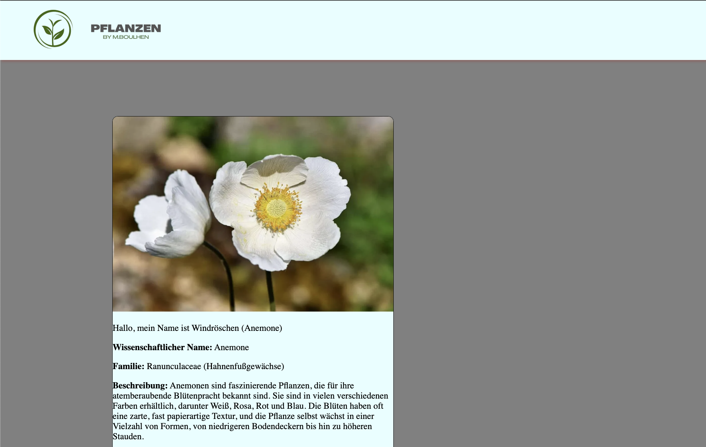

# Plant Project

## Description

This is an Angular application aimed at showcasing various plants with detailed information and images. The project is currently in its early stages and is still under development.

## Features

- **Header Component**: Displays a header with navigation options.
- **Pflanzen Card Component**: Shows detailed information about different plants, including images and descriptions.

## Screenshots

Here are some screenshots of the current state of the application:



## Current Status

This project is in the early stages of development. Features are being added, and the application is undergoing active development. Check back for updates as new features and improvements are implemented.

## Installation

To set up the project locally, follow these steps:

1. **Clone the Repository**

   ```bash
   git clone https://github.com/MohamedBoulhen/plant-project.git
